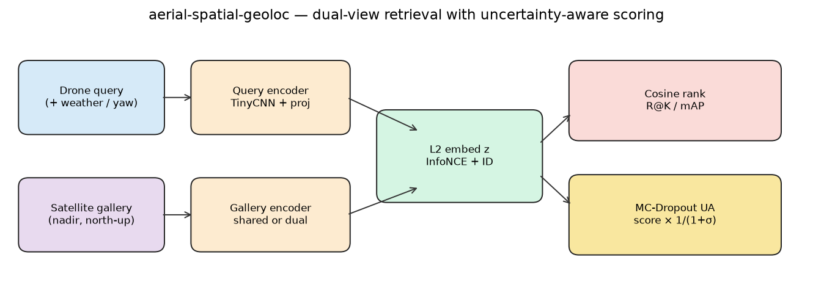
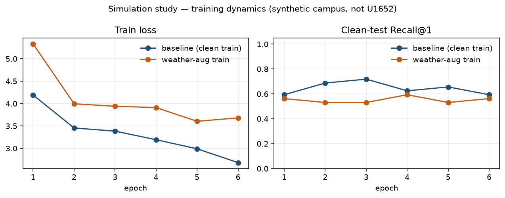
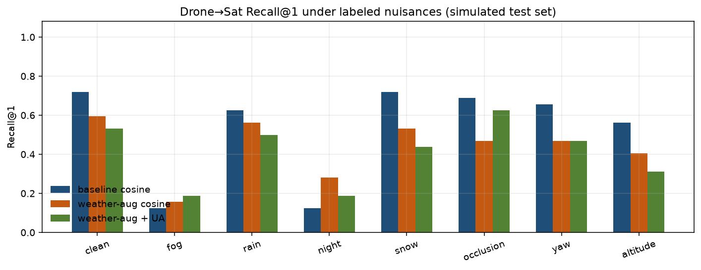
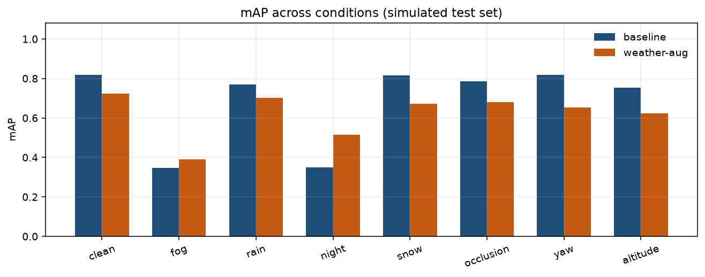
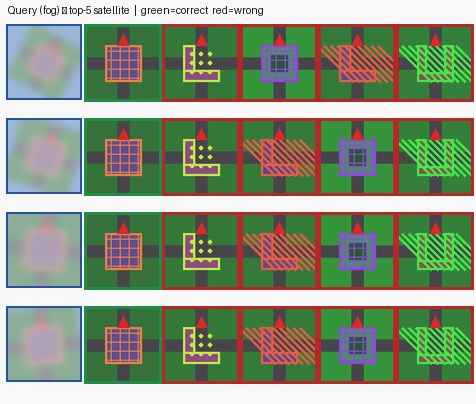
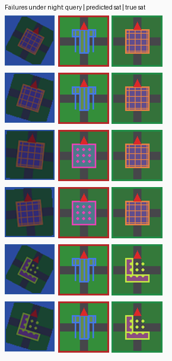
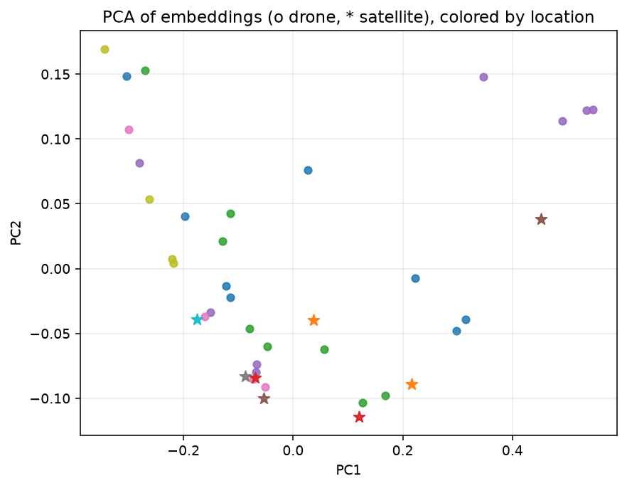
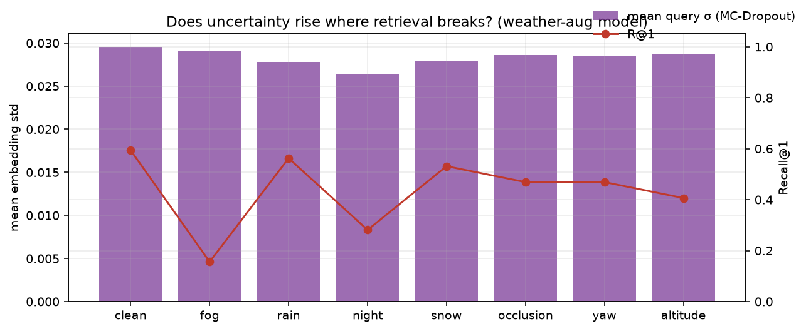

# aerial-spatial-geoloc

**Simulation-driven study of drone → satellite retrieval under weather, geometry, and uncertainty.**

I am **Magne Dina Neves** ([KRYPTON0078](https://github.com/KRYPTON0078)), 4th-year ECE at the University of Macau, CPS RA, robotics (SpiderPi hexapod hackathon). This repo is the piece of work I would put in front of **Prof. Zhedong Zheng** (AIGC-DL Lab): not a notebook dump, and not a fake University-1652 leaderboard.

Cross-view geo-localization is the spatial primitive behind low-altitude / smart-city UAVs — last-meter delivery, inspection, GNSS-denied “where am I on the map?” University-1652 ([Zheng, Wei, Yang, ACM MM 2020](https://doi.org/10.1145/3394171.3413896)) defined the drone↔satellite exam. WeatherPrompt ([Wen, Yu, Zheng, NeurIPS 2025](https://arxiv.org/abs/2508.09560)) showed how fast those matchers die in fog and night. Ctrl-U ([Zhang, Gao, Zheng, ICLR 2025](https://proceedings.iclr.cc/paper_files/paper/2025/file/d76f8ea185a09f1dbb57a3365a4af768-Paper-Conference.pdf)) treated **prediction variance as something you can actually use**.

This toolkit implements a **CPU-reproducible analogue** of that research story: a pose-labeled simulated campus, dual-view InfoNCE, weather-aug vs clean training, and MC-Dropout uncertainty-aware scoring. Real U1652 numbers are left blank until they are measured here.

**Read next:** [experiment report](reports/EXPERIMENT_REPORT.md) · [literature review](docs/literature_review.md) · [raw metrics](reports/metrics.json) · [sim data](data/sim/)

## 中文摘要

面向无人机–卫星跨视角检索的 PyTorch 工具包：**可控仿真世界**（位姿与天气标签已知）、InfoNCE 双塔、天气增强与 MC-Dropout 不确定性加权。干净训练在仿真测试上 R@1=0.719，雾/夜降至 0.125；天气增强用干净集精度换夜视 R@1 0.281。文献综述、实验报告与全部图均在仓库内（见下方图库）。**不是** University-1652 榜单数字。

## Method

Shared TinyCNN encodes drone and satellite tiles into L2-normalized embeddings; train with symmetric InfoNCE + identity loss. Test nuisances are **named** (fog, rain, night, snow, occlusion, yaw, altitude), not mystery noise. UA scoring: \(T=6\) dropout samples on the query, \(\mathrm{score}=\cos/(1+\sigma)\). Gallery stays deterministic.

<p align="center">
  
</p>

*Figure 1. Dual-view retrieval: query/gallery encoders, InfoNCE + ID loss, cosine rank, and MC-Dropout uncertainty-aware scoring. Drawn from the measured study pipeline, not a screenshot of WeatherPrompt.*

```mermaid
flowchart LR
  D[Drone + labeled nuisance] --> QE[Query encoder + dropout]
  S[Satellite nadir] --> GE[Shared / dual encoder]
  QE --> ZQ["z_q, σ"]
  GE --> ZG["z_g"]
  ZQ --> R["cosine × 1/(1+σ)"]
  ZG --> R
  R --> M[R@1 / mAP]
```

## Results (synthetic campus, seed 42, CPU TinyCNN)

**Not University-1652.** 12 train / 8 test locations, 32 drone queries. Full tables and discussion: [`reports/EXPERIMENT_REPORT.md`](reports/EXPERIMENT_REPORT.md). Source of every number: [`reports/metrics.json`](reports/metrics.json).

| Condition | Baseline R@1 | Weather-aug R@1 | Weather-aug + UA R@1 |
| --- | ---: | ---: | ---: |
| clean | **0.719** | 0.594 | 0.531 |
| fog | 0.125 | 0.156 | **0.188** |
| night | 0.125 | **0.281** | 0.188 |
| occlusion | **0.688** | 0.469 | 0.625 |

Weather-aug **pays on clean data** and **buys night/fog**. Uncertainty-aware scoring helps occlusion for the weather-aug model and is not magic. That tradeoff is the point.

### Figure gallery

Every PNG below is committed under [`figures/`](figures/) and was generated by `python -m aerial_geoloc.cli study` from the metrics in `reports/metrics.json`.

<p align="center">
  
</p>

*Figure 2. Training dynamics. Clean training reaches R@1 0.719 then overfits slightly. Weather-aug has a harder loss and a lower clean-test ceiling — the robustness tax.*

<p align="center">
  
</p>

*Figure 3. Drone→Sat Recall@1 under labeled nuisances. Baseline wins clean/rain/snow/geometry; weather-aug + UA help fog; weather-aug cosine helps night.*

<p align="center">
  
</p>

*Figure 4. Same protocol, mAP. Night and fog are the only conditions where weather-aug beats the clean specialist on this renderer.*

<p align="center">
  
</p>

*Figure 5. Qualitative retrieval under fog (weather-aug model). Left: query. Right: top-5 satellite tiles. Green border = correct location ID. A sample of queries, not the split-average R@1.*

<p align="center">
  
</p>

*Figure 6. Failure collage under night (clean-trained baseline): query | predicted satellite | true satellite.*

<p align="center">
  
</p>

*Figure 7. PCA of embeddings (circles = drone, stars = satellite), colored by location. Overlap of the two markers is what dual-view InfoNCE is trying to achieve.*

<p align="center">
  
</p>

*Figure 8. Mean MC-Dropout σ (bars) vs R@1 (line) for the weather-aug model. Night/fog are high-error; σ is not a perfectly calibrated “I am wrong” detector on this tiny encoder — reported as-is.*

## Reproduce every figure and table (CPU, minutes)

```bash
python -m venv .venv && source .venv/bin/activate
pip install -e ".[dev,study]"
python -m aerial_geoloc.cli study --config configs/study.yaml --regenerate
pytest
```

That regenerates `data/sim/`, trains two models, writes `reports/metrics.json` and `figures/*.png`. **Shipped copies of those artifacts are already in the tree** so a clone can read this gallery without waiting.

```bash
python -m aerial_geoloc.cli sim-generate --root data/sim   # data only
python -m aerial_geoloc.cli train --config configs/demo.yaml
python -m aerial_geoloc.cli retrieve --config configs/demo.yaml --checkpoint outputs/demo/best.pt
```

University-1652 (academic, non-commercial): [`docs/DATASETS.md`](docs/DATASETS.md) then `configs/default.yaml`. Do not paste LPN/WeatherPrompt tables into this README as if they were ours.

## Artifact index

| Path | What it is |
| --- | --- |
| [`figures/architecture.png`](figures/architecture.png) | Method diagram (Fig. 1) |
| [`figures/training_curves.png`](figures/training_curves.png) | Loss + clean R@1 (Fig. 2) |
| [`figures/recall_by_condition.png`](figures/recall_by_condition.png) | R@1 bars (Fig. 3) |
| [`figures/map_by_condition.png`](figures/map_by_condition.png) | mAP bars (Fig. 4) |
| [`figures/retrieval_grid_fog.png`](figures/retrieval_grid_fog.png) | Top-k grid (Fig. 5) |
| [`figures/failures_night.png`](figures/failures_night.png) | Failure collage (Fig. 6) |
| [`figures/embedding_pca.png`](figures/embedding_pca.png) | Embedding PCA (Fig. 7) |
| [`figures/uncertainty_vs_recall.png`](figures/uncertainty_vs_recall.png) | σ vs R@1 (Fig. 8) |
| [`reports/EXPERIMENT_REPORT.md`](reports/EXPERIMENT_REPORT.md) | Paper-like write-up |
| [`reports/metrics.json`](reports/metrics.json) | Raw measured metrics |
| [`data/sim/`](data/sim/) | Pose-labeled campus (~1.5 MB, 168 tiles) |
| [`docs/literature_review.md`](docs/literature_review.md) | Related work + 中文摘要 |

## Package

```
src/aerial_geoloc/       config, data adapters, DualViewEncoder, train/eval
src/aerial_geoloc/sim    pose-labeled campus + nuisances
src/aerial_geoloc/study  CPU experiment + figure generation
data/sim/                shipped simulated split
figures/                 committed PNGs from the measured run
reports/                 EXPERIMENT_REPORT.md + metrics.json
docs/literature_review.md
```

MIT. Ablation YAMLs: `configs/ablation_*.yaml`. Optional UI: `pip install -e ".[ui]"`.

## Related work (pointers)

University-1652 · LPN · FSRA · MuSe-Net · WeatherPrompt · Ctrl-U · MC-Dropout — full citations in the [literature review](docs/literature_review.md).

## About

Magne Dina Neves · ECE, University of Macau · CPS RA · [github.com/KRYPTON0078](https://github.com/KRYPTON0078)
