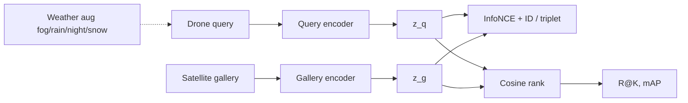

# aerial-spatial-geoloc

PyTorch toolkit for **drone ↔ satellite / cross-view aerial geo-localization**.

I am **Magne Dina Neves** (GitHub [KRYPTON0078](https://github.com/KRYPTON0078)), a 4th-year ECE student at the University of Macau and a CPS research assistant. My applied work is in robotics (including a SpiderPi hexapod hackathon win). This repository is a compact, readable baseline I can actually train and ablate — aimed at RA / remote internship / Master's conversations with **Prof. Zhedong Zheng** and the [AIGC-DL Lab](https://zdzheng.xyz/) themes of *aerial spatial intelligence*, University-1652, and WeatherPrompt-style robustness.

It is **not** a re-implementation of WeatherPrompt, and it does **not** claim University-1652 numbers I have not measured.

## 中文摘要

本仓库是一个面向 **无人机–卫星跨视角地理定位** 的 PyTorch 工具包：双分支 / 共享编码器、InfoNCE 与身份分类损失、University-1652 数据适配器，以及可在 CPU 上跑通的合成 demo 数据。动机对齐澳门大学 AIGC-DL Lab 的空中空间智能与全天候鲁棒检索方向。完整实验请在 University-1652 上复现；README 中的指标表在测到真实数据前保持占位，**不含编造结果**。

## Why this problem

Drones sit between street-level cameras and nadir satellites. Matching an oblique UAV frame to a geo-referenced satellite tile is a core primitive for **low-altitude economy / smart-city** stacks: last-meter delivery, inspection, and “where am I on the map?” when GNSS is noisy.

University-1652 (Zheng, Wei, Yang, ACM MM 2020) made that setting measurable: 1,652 buildings, three platforms (drone, satellite, street), and two tasks — **drone-view target localization** (drone → satellite) and **drone navigation** (satellite → drone). WeatherPrompt (Wen, Yu, Zheng, NeurIPS 2025) then showed how brittle those matchers are under fog, rain, night, and snow.

This repo packages a clean **research baseline** around that protocol: typed YAML configs, seed control, checkpoints, retrieval metrics (Recall@K, mAP), weather augmentations as an ablation, and a synthetic campus so `train` works without a multi-GB download.

## Method overview

```
 drone image                         satellite image
      │                                    │
      ▼                                    ▼
 ┌─────────────┐                    ┌─────────────┐
 │ query branch│   shared or dual   │ gallery br. │
 │ CNN / ViT   │                    │ CNN / ViT   │
 └──────┬──────┘                    └──────┬──────┘
        │  z_q  L2-normalized              │ z_g
        └─────────────┬────────────────────┘
                      ▼
         InfoNCE (in-batch)  +  optional ID loss
                      ▼
         cosine retrieval  →  Recall@K / mAP
```



- **Backbones:** `tiny_cnn` (CPU demo), ResNet-18/50, Tiny ViT.
- **Encoders:** `shared` (one backbone, University-1652 CNN-baseline style) or `dual` (view-specific).
- **Losses:** symmetric InfoNCE, identity classification (location ID), or batch-hard triplet — see `loss.name` and the `configs/ablation_*.yaml` flags.
- **Weather:** classical corruptions for a WeatherPrompt-*style* stress test, not the paper’s VLM text-gating model.

## Repository layout

```
src/aerial_geoloc/
  config.py          typed YAML → dataclasses
  data/              demo generator, U1652 adapter, weather, transforms
  models/            backbones, DualViewEncoder, losses
  engine/            train, eval, retrieval, checkpoints
  cli.py             aerial-geoloc train | eval | retrieve | app
configs/             demo + ablation YAMLs
tests/               data, transforms, losses, metrics, one-step train
docs/DATASETS.md     University-1652 download and folder contract
```

## Quickstart (no University-1652 download)

```bash
python -m venv .venv && source .venv/bin/activate
pip install -e ".[dev]"
python -m aerial_geoloc.cli make-demo-data --root data/demo
python -m aerial_geoloc.cli train --config configs/demo.yaml
python -m aerial_geoloc.cli eval --config configs/demo.yaml --checkpoint outputs/demo/best.pt
python -m aerial_geoloc.cli retrieve --config configs/demo.yaml --checkpoint outputs/demo/best.pt --topk 5
pytest
```

`dataset: demo` also auto-writes the synthetic tiles on first train. Ablations:

```bash
python -m aerial_geoloc.cli train --config configs/ablation_dual_branch.yaml
python -m aerial_geoloc.cli train --config configs/ablation_weather.yaml
python -m aerial_geoloc.cli train --config configs/ablation_vit.yaml
python -m aerial_geoloc.cli train --config configs/ablation_id_loss.yaml
# or override flags
python -m aerial_geoloc.cli train --config configs/demo.yaml --backbone vit_tiny --encoder dual --loss infonce --weather-aug
```

Optional Gradio UI (`pip install -e ".[ui]"`):

```bash
python -m aerial_geoloc.cli app --config configs/demo.yaml --checkpoint outputs/demo/best.pt
```

## University-1652 (real data)

See [docs/DATASETS.md](docs/DATASETS.md). After you have `train/` and `test/` on disk:

```bash
python -m aerial_geoloc.cli train --config configs/default.yaml
```

University-1652 is **non-commercial academic** imagery (Google Maps/Earth terms apply). This repo never vendors those pixels.

## Metrics

Protocol matches the usual U1652 retrieval setup: embed query and gallery, rank by cosine similarity, report **Recall@K** and **mAP**.

| Split | Data | Backbone | Encoder | Loss | Weather | R@1 | R@5 | mAP | Notes |
| --- | --- | --- | --- | --- | --- | --- | --- | --- | --- |
| Drone → Sat | U1652 test | ResNet-18 | shared | InfoNCE+ID | off | — | — | — | *placeholder — fill after you train on U1652* |
| Sat → Drone | U1652 test | ResNet-18 | shared | InfoNCE+ID | off | — | — | — | *placeholder* |
| Drone → Sat | U1652 test | ResNet-18 | shared | InfoNCE+ID | train-time fog/rain/night/snow | — | — | — | *placeholder; compare to WeatherPrompt table, do not copy their numbers* |
| Drone → Sat | **synthetic demo** (8 locs, 48 queries) | TinyCNN | shared | InfoNCE+ID | off | 0.812 | 1.000 | 0.906 | CPU, seed 42, `configs/demo.yaml`, **best.pt**. Geometric tiles, **not** University-1652. |

I will not paste fabricated University-1652 scores. The demo row above was measured in this repository on the synthetic split (`python -m aerial_geoloc.cli train --config configs/demo.yaml`). Re-runs can move a few points; they still say nothing about U1652.

## Design choices (skimmable)

- **Typed configs** (`ExperimentConfig`) so backbone / loss / weather are explicit ablation knobs, not argparse archaeology.
- **Seed + checkpoint + JSONL logs** so a short run is inspectable.
- **Adapters, not loaders inlined in `train.py`:** University-1652 folder contract is isolated; demo data uses the same `Sample` record.
- **Honest scope:** no VLM weather captions, no fake SOTA table, MIT license.

## Related work

1. Zheng, Wei, Yang. *University-1652: A Multi-view Multi-source Benchmark for Drone-based Geo-localization*. ACM MM 2020.  
   https://arxiv.org/abs/2002.12186 · https://github.com/layumi/University1652-Baseline
2. Wen, Yu, Zheng. *WeatherPrompt: Multi-modality Representation Learning for All-Weather Drone Visual Geo-Localization*. NeurIPS 2025.  
   https://arxiv.org/abs/2508.09560 · https://github.com/Jahawn-Wen/WeatherPrompt
3. Zhu et al. SUES-200 (multi-height drone geo-localization); stub adapter in `aerial_geoloc.data.sues200`.
4. Work in the same family: LPN / FSRA and other U1652 baselines — useful comparisons once real training is logged here.

```bibtex
@inproceedings{zheng2020university,
  title={University-1652: A Multi-view Multi-source Benchmark for Drone-based Geo-localization},
  author={Zheng, Zhedong and Wei, Yunchao and Yang, Yi},
  booktitle={Proceedings of the ACM International Conference on Multimedia (ACM MM)},
  year={2020}
}

@inproceedings{wen2025WeatherPrompt,
  author={Wen, Jiahao and Yu, Hang and Zheng, Zhedong},
  title={WeatherPrompt: Multi-modality Representation Learning for All-Weather Drone Visual Geo-Localization},
  booktitle={NeurIPS},
  year={2025}
}
```

## License

MIT — see [LICENSE](LICENSE). Dataset licenses are separate and stricter.

## About

Magne Dina Neves · ECE, University of Macau · CPS RA · [github.com/KRYPTON0078](https://github.com/KRYPTON0078)
